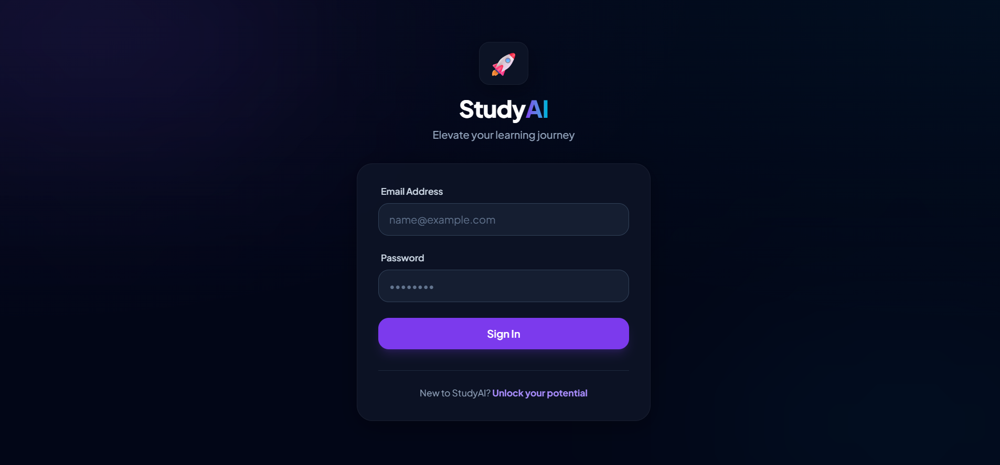
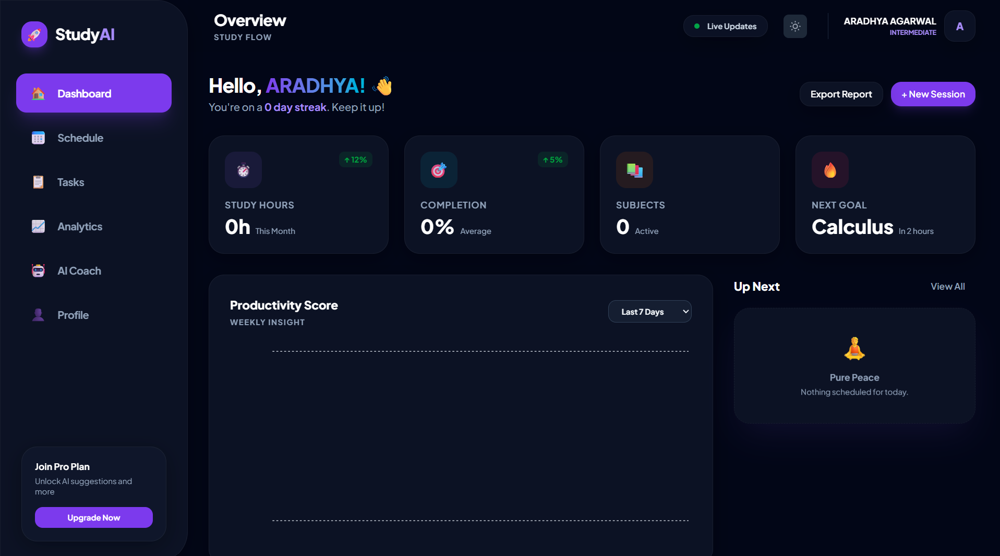
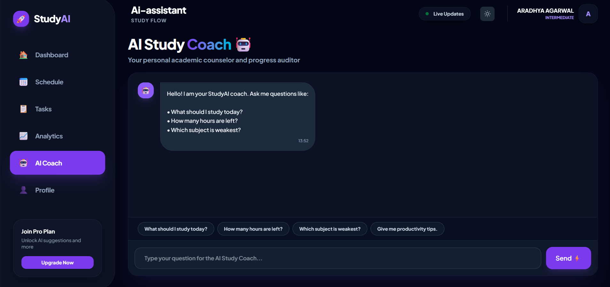

# 🚀 AI Study Planner

An AI-powered Full Stack Study Planner that helps students manage study schedules, tasks, productivity analytics, and receive intelligent study recommendations.

---

## 🌐 Live Demo

https://ai-study-planner-rust.vercel.app

---

## ✨ Features

- 🔐 JWT Authentication
- 📅 Smart Study Scheduler
- ✅ Task Management
- 📊 Productivity Dashboard
- 🤖 AI Study Coach
- 📈 Analytics
- 👤 User Profile
- 🌙 Dark Theme UI
- 📱 Fully Responsive

---

## 🛠 Tech Stack

### Frontend

- React.js
- Vite
- Tailwind CSS
- Axios

### Backend

- Node.js
- Express.js
- MongoDB
- JWT
- bcrypt

---

## 📂 Project Structure

```
AI_STUDY_PLANNER
│
├── frontend
├── backend
└── screenshots
```

---

## 📸 Screenshots

### Login



---

### Dashboard



---

### AI Study Coach



---

## ⚙ Installation

### Clone Repository

```bash
git clone https://github.com/ARADHYA200/AI_STUDY_PLANNER.git
```

### Backend

```bash
cd backend
npm install
npm start
```

### Frontend

```bash
cd frontend
npm install
npm run dev
```

---

## Future Improvements

- AI Generated Study Plans
- Google Calendar Integration
- Email Notifications
- Mobile Application
- Pomodoro Timer
- Leaderboards

---

## Author

Aradhya Agarwal

GitHub:
https://github.com/ARADHYA200